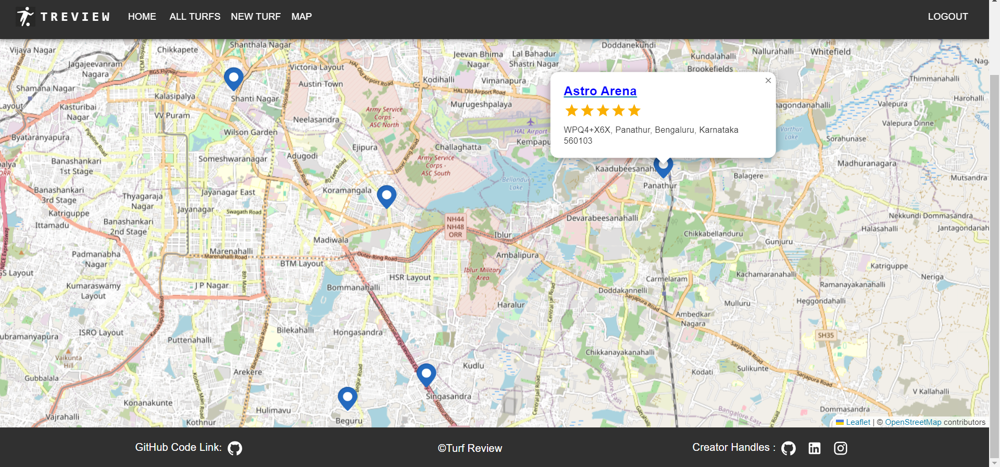

# TurfReview

To view project, click [here](https://turfreview.vercel.app)

## Overview

TurfReview is a comprehensive system for reviewing and exploring turf locations. Whether you're a sports enthusiast, event planner, or someone looking for the perfect turf for your activities, TurfReview has you covered.

## Preview



Furthur images present in ./project_images

## Key Features

- **Explore Turf Locations**: Discover a variety of turf locations suitable for sports, events, and recreational activities.
- **Reviews and Ratings**: Users can share their experiences by providing reviews and ratings for turf locations.
- **GeoSpatial Data Entry**: Captures geographic coordinates and marks the turf on a map.
- **User-Friendly Interface**: The system features an intuitive and user-friendly interface for seamless navigation and interaction.
- **Authentication**: User Authentication and Verification using JWT and BCRYPT.
- **Image Uploading**: Using multer and storing the images on a third party website (cloudinary)

## Contribute:

Found a bug or have an enhancement in mind? Contribute to the project by opening issues and pull requests.

## Running the project

- **Cloning the repository**: To clone the repository onto your machine, run `git clone https://github.com/SudeevDivakar/Turf-Review-System.git`
- **Change Working Directory to TurfReview**: To change the cwd to TurfReview, run `cd Turf-Review-System`
- **Installing Dependencies**: To install the dependencies for both client and server, run

```
cd client
npm install
cd ../server
npm install
```

- **Environment Variables**: Now create a `.env` file in the server directory and fill it with the appropriate values:

```
PORT=3000           #Backend Port Number
DB_URL=          #URL to the mongoDB database
JWT_SECRET=		#Secret key for JWT (can be anything)
CLOUDINARY_CLOUD_NAME=		# Details of cloudinary
CLOUDINARY_KEY=
CLOUDINARY_SECRET=
```

- **Start Up the Front and Backend servers**

```
cd ../client
npm run dev
cd ../server
npm run dev
```

- Open up the react server on 'http://localhost:5173/register'

- The code has now successfully been run :)

<font color="grey"><i>---Optional---</i></font>

- **Seeding the Database (Entering dummy values into the database)**:
  Now, on 'http://localhost:5173/register' create an account using a valid username and password.
  Once the account is created, open cmd and type in the following commands:

```
mongosh
use TurfReview
db.users.find({})
```

Now copy the ObjectID present within ObjectId('') and paste it within the .env file created in the server directory.
Your .env file should look something like this now,

```
PORT=3000
DB_URL=
JWT_SECRET=
CLOUDINARY_CLOUD_NAME=
CLOUDINARY_KEY=
CLOUDINARY_SECRET=
DATABASE_SEED_AUTHOR=
```

In the server directory, run:

```
node seeds/seed.js
npm run dev
```

This should seed the database with dummy values.
